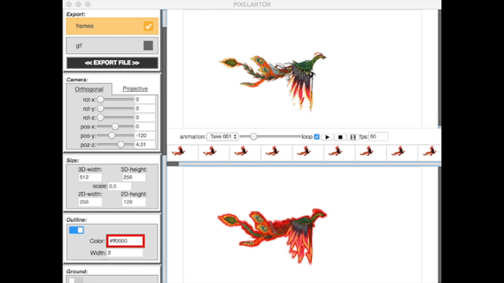
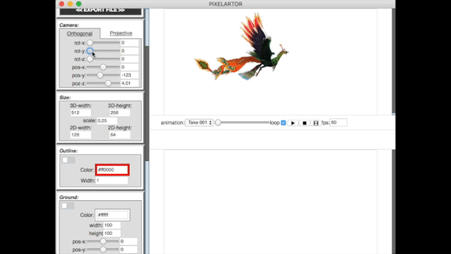
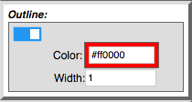
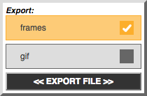
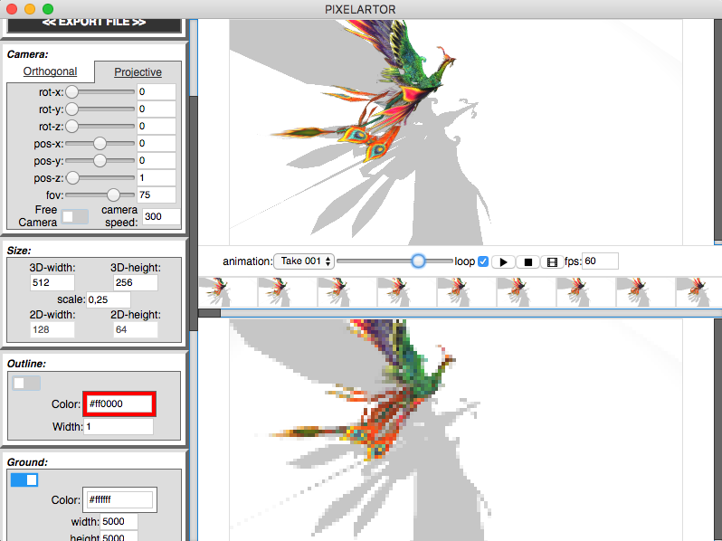
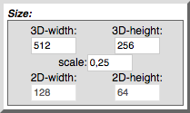

# PIXELARTOR

PIXELARTOR is animation tool to create 2D frame images from 3D scenes/models with or without animations. Generated animation frames can be exported into gif image or ZIP file with sprites.<br />
PIXELATOR support only glTF file at the moment, but more formats will be added soon.<br />
This Tool is heavily inspired Dead Cell pipeline article on [Gamasutra website](https://www.gamasutra.com/view/news/313026/Art_Design_Deep_Dive_Using_a_3D_pipeline_for_2D_animation_in_Dead_Cells.php) and with my passion at scripting and pixelart.

**NOTE**: I'll try to make monthly distributions with new features and fixes from TO-DO list below.

<p align="center">
	
</p>

## Usage
- Open glTF file to load 3D scene, if there's animations within the scene PIXELARTOR will load them and they can be played.
- set camera and other features (as lights or outline) as you need
- click generate button to create spriteframe(s) of scene
- export to sprites or gif (others format soon)

## Features

### Orthogonal &amp; Projective Camera
Normal Orthogonal camera with position and rotation settings &amp; Projection camera with free look controls using mouse and keyboard.
<p align="center">
	
</p>

### Outline
Outline settings with width and color attribute for exported frames of the scene.
<p align="center">
    
</p>

### Export
Export generated animation or scene into sprite frames or gif image.
<p align="center">
    
</p>

### Hemisphere, Direct and Point Lights
Add lights into a scene. Direct and Point lights can produce shadows at the added ground mesh or other meshes within a scene.

### Ground
Add plane mesh serving as a ground for a lights with shadow.

**NOTE:** this will remove outlines oround loaded mesh (work in progress)
<p align="center">
    
</p>

### Size
Controls of the size 3D view with loaded scene and 2D view for generated frames.
<p align="center">
    
</p>

## Support
Support the development of this project on Patreon: [](https://www.patreon.com/chleba)

You can support the development of this project via **PayPal**: [PayPal link](https://paypal.me/chleba) 

This is my e-mail address for businesses or if you just want to contact me:
**chlebalukas at gmail dot com**

Also feel free to contact me and suggest some missing feature you would like me to implement.

## TODO
There are some features that I am looking to implement:
 - fixing cameras position controls
 - add more supported 3D formats
 - generating normal map textures
 - loading videos
 - selecting range of generated frames
 - fixing lights and shadow
 - add transparent ground mesh for functional outlines and shadows
 - add timeline for camera move animation
 - export into a spritesheet with customize grid
 - export into a video file
 - better UI
 - mesh inspector with simple color shaders
 - ** rewrite into native C++ application with custom animation control **

## Binaries
To get started you can visit [Release](https://github.com/Chleba/PIXELARTOR/releases) page and download
latest stable binary release (v0.1.0).

If you want to compile the program yourself, install [yarn](https://yarnpkg.com/en/docs/install)
Then run following command in app directory: ```yarn install``` and then ```yarn start``` for developing or ```yarn dist``` for binary.

## Credits
Thanks to [**NORBERTO-3D**](https://sketchfab.com/norberto3d) for Phoenix bird model for testing purposes.
Thanks to Electron, yarn, THREEJS teams and all others developers for their hard work on amazing libraries and frameworks that i've been able to use easily to create this tool. (see [package.json](./package.json) for every package I used and it's developers)

## LICENSE
SHADERed is licensed under MIT license. See [LICENSE](./LICENSE) for more details.